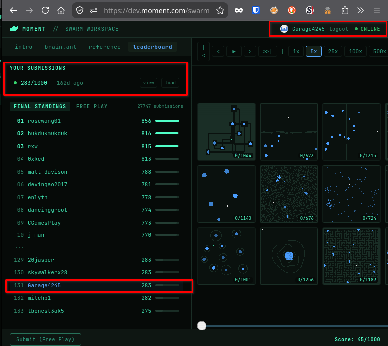

# SWARM — Ant Colony Challenge

This repository contains my submission to **SWARM**, an ant colony optimisation programming challenge created by Moment.

In the challenge, a single program acts as the "brain" for **200 ants** exploring a **128×128 grid**. The ants must find food and return it to the nest. They cannot communicate directly; instead, they coordinate by leaving and following pheromone trails.

The same program runs on every ant. The only differences between them come from their IDs, registers, local state, and the pheromones they encounter.

## My Result

- **Username:** Garage4245
- **Score:** **283 / 1000**
- **Ranking:** **131st** out of nearly **27,000 submissions**

## The Challenge

The ants were programmed using **Antssembly**, a small assembly-like language provided with the challenge.

Each ant could:

- Sense nearby food, walls, the nest, and other ants
- Move in the four cardinal directions
- Pick up and drop food
- Read and write four pheromone channels
- Use registers, arithmetic, jumps, calls, and conditional branches
- Use its ID to specialise into different roles

The final score was based on the average percentage of food delivered across **120 procedurally generated maps**, covering open environments, mazes, bridges, chambers, fortresses, islands, and other layouts.

## Strategy

My submission uses a combination of role specialisation, pheromone gradients, exploration patterns, and wall-following.

The colony is divided into:

- **Workers** — search for food, collect it, and return it to the nest.
- **Drones** — explore the map and mark potential food locations without collecting food themselves.

The program uses three pheromone channels:

- **Red / FOOD_TRAIL** — guides workers outward towards food.
- **Blue / HOME_TRAIL** — provides information related to the route back towards the nest.
- **Green / LOOP_TRAIL** — temporary breadcrumbs used while wall-following to reduce loops.

Returning workers reinforce the food trail using a Manhattan-distance gradient. When a direct route home is blocked, the ants use a Bug2-inspired wall-following strategy and attempt to escape once they have made progress towards the nest.

The full implementation is available in [`brain.ant`](brain.ant).

## Repository Contents

- `brain.ant` — my final Antssembly submission.

## Original Challenge

The original SWARM challenge was hosted by Moment:

https://dev.moment.com/swarm

## My Challenge Repository

This solution is also published on my GitHub account created specifically for this challenge:

[Garage4245/Ant-Colony-Challenge](https://github.com/Garage4245/Ant-Colony-Challenge)

The repository contains the same submission and documentation, with an additional note specific to that account.

## Leaderboard

> Final leaderboard result: **131st place** out of nearly **27,000 submissions**, with a score of **283/1000**.
